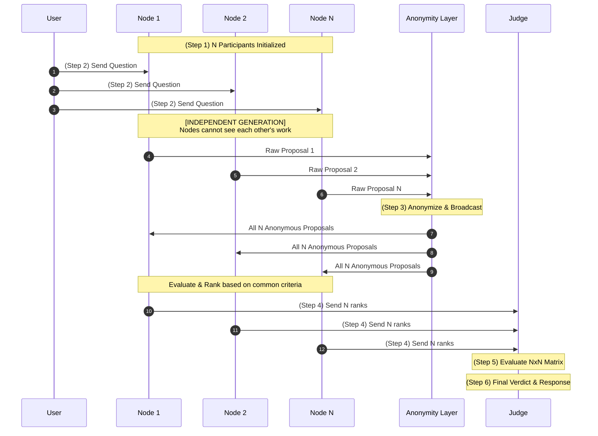

# ByzantineLLM: Blind Consensus Framework

ByzantineLLM is a research framework for studying **Byzantine Fault Tolerance (BFT)** and emergent truth in Large Language Model clusters. It implements a strict N x N ranking protocol where the system has **zero prior knowledge** of adversarial agents.

---

## 🏗️ The Blind Consensus Workflow

The system operates under a "Zero-Trust" policy through a deterministic 6-step workflow:



1.  **Independent Initialization:** N participants (using different LLMs) are initialized. The system does not label or instruct any node to be "Byzantine."
2.  **Parallel Proposal:** All participants receive the **same question** and generate an independent answer.
3.  **Blind Cross-Auditing:** All responses are anonymized (e.g., "Participant A"). Every participant evaluates all N anonymous responses based on objective criteria.
4.  **Independent Ranking:** Participants submit a ranked list of these anonymous IDs to the Judge.
5.  **Matrix Discovery:** The **Judge** evaluates the $N \times N$ ranking table. It must **discover** Byzantine behavior (hallucinations, bias, or sabotage) purely through statistical outliers and logical inconsistencies in the matrix.
6.  **Verified Synthesis:** The Judge de-anonymizes the winner and generates a final authoritative response.

---

## 📊 Technical Complexity

The framework is designed for high-integrity consensus, balancing auditing depth with API efficiency. While the **logical discovery matrix** scales quadratically ($N^2$), the number of **API calls** remains linear ($O(N)$) through batch ranking:

| Phase | API Calls | Peer Evaluations | Description |
| :--- | :--- | :--- | :--- |
| **Generation** | $N$ | - | Each node generates an independent proposal. |
| **Audit** | $N$ | $N^2$ | $N$ nodes each evaluate all $N$ peer proposals. |
| **Judgment** | $1$ | $2N$ | The Judge evaluates $N$ rankings and $N$ proposals. |
| **Total** | **$2N + 1$** | **$N^2 + 2N$** | **Linear API cost / Quadratic discovery depth.** |

> **Note on Efficiency:** By batching the Audit phase into $N$ calls rather than $N^2$, we allow the models to perform *relative ranking*, which is significantly more effective at identifying quality outliers than isolated rating. However, as noted in the research section, the **input token volume** still scales quadratically ($O(N^2)$).

---

## 🚀 Key Features

*   **Zero-Knowledge Protocol:** No node is pre-assigned a "Byzantine" role. Malicious behavior is discovered, not declared.
*   **Total Anonymity:** Participants cannot see model names or node identities during evaluation, ensuring purely content-based auditing.
*   **PromptBuilder Architecture:** Highly extensible system for constructing dynamic system and user prompts (supporting RAG, custom personas, etc.).
*   **Numerical Scoring:** Every participant is assigned a score (0-10) based on their consensus ranking and content quality.
*   **Self-Healing Consensus:** The protocol is designed to isolate low-quality or adversarial contributions through peer-to-peer disagreement analysis.
*   **Heterogeneous Evaluation:** Mix high-capability and low-capability models to test how the "Byzantine" effect naturally emerges.

---

## 🛠️ Quick Start

### Installation
```bash
pip install -r requirements.txt
```

### Run via CLI
```bash
python consensus_cli.py \
  --topic "Explain the core mechanism of Byzantine Fault Tolerance." \
  --n 3 \
  --node-model "gpt-4o-mini" \
  --judge-model "gpt-4o"
```

---

## 💻 Python API

```python
from src.byzantine import ByzantineLLM, ByzantineModelsConfig, PromptBuilder

# 1. Configure the network
models = ByzantineModelsConfig(
    node_models=["gpt-4o-mini", "claude-3-haiku", "gemini-1.5-flash"],
    judge_model="gpt-4o"
)

# 2. (Optional) Customize prompts
builder = PromptBuilder(
    system_prompt="You are a senior distributed systems engineer.",
    user_template="Explain this for a technical audience: {topic}"
)

# 3. Initialize and run the engine
engine = ByzantineLLM(models, prompt_builder=builder, temperature=0.5)
result = engine.run("What is Byzantine Fault Tolerance?")

print(f"Winner: {result.winner}")
print(f"Scores: {result.final_scores}")
print(f"Verified Answer: {result.final_response}")
```

---

## 📜 Examples
Check the `examples/` directory for more detailed scenarios:
- `01_basic_consensus.py`: Simple entry point.
- `02_custom_prompts.py`: Using custom system/user templates.
- `03_temperature_control.py`: Stable vs. Creative modes.
- `04_using_config_file.py`: Loading from JSON dictionaries.
- `05_custom_builder.py`: Subclassing `PromptBuilder` for dynamic logic.

---

## 🎓 Project Merit & Research Analysis

This framework has been evaluated based on standard software engineering and distributed systems research rubrics.

### 🌟 Originality and Conceptual Depth
ByzantineLLM bridges the gap between **Distributed Systems Theory** and **Generative AI**. By applying **Byzantine Fault Tolerance (BFT)** principles to LLM outputs, the project moves beyond simple "majority voting" and into a deterministic "Zero-Trust" auditing model. The **NxN Blind Audit** protocol is a novel approach to identifying hallucinations and bias without a predefined "ground truth."

### 🏗️ Architectural Design
The codebase follows senior-level engineering patterns:
*   **Modular Orchestration:** The `ByzantineLLM` engine encapsulates a complex 6-step lifecycle while exposing a clean, high-level API.
*   **Strategy Pattern:** The `PromptBuilder` architecture allows for total extensibility, enabling RAG injection, dynamic personas, and multi-application support without modifying the core consensus logic.
*   **Type Integrity:** Leveraging **Pydantic** ensures that the data flow between heterogeneous LLM participants remains structured and verifiable.

### 💻 Implementation Quality
*   **Zero-Knowledge Consistency:** The system strictly enforces identical parameters (System Prompt, User Prompt, Temperature) across the cluster, ensuring auditing is purely content-based.
*   **Numerical Scoring:** Moves beyond binary "Win/Loss" outcomes by providing a weighted scoring matrix for every participant.
*   **Production Readiness:** Includes a robust CLI, detailed logging, and a comprehensive suite of examples.

### 📈 Future Research Directions
To further evolve this framework, the following areas are identified for future implementation:
1.  **Parsing Robustness:** Implementation of auto-retrying logic and structured JSON output modes to handle LLM formatting variance.
2.  **Scalability (Committee Sharding):** Developing sharding protocols to manage the quadratic context growth in large $N$ clusters.
3.  **Adversarial Modeling:** Pre-configuring specific "Byzantine" nodes to benchmark the Judge's detection capabilities.

---

## 📜 License
Distributed under the **MIT License**.
