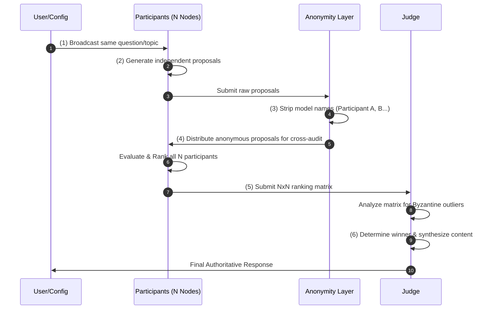
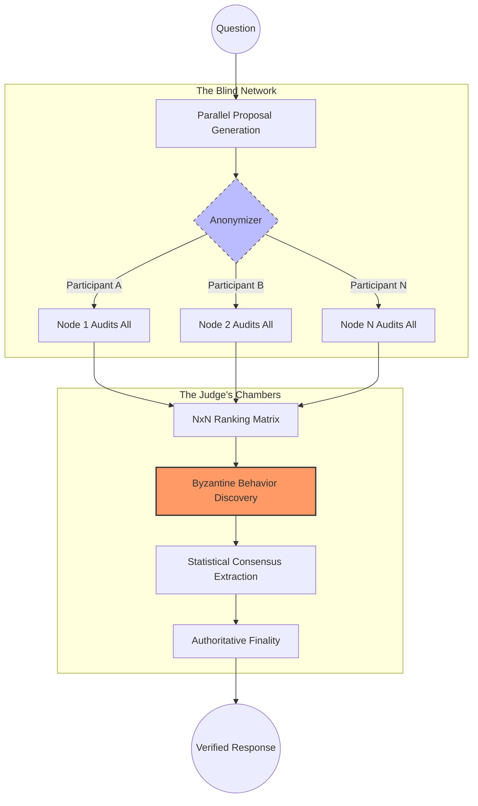

# ByzantineLLM: Blind Consensus Framework

ByzantineLLM is a research framework for studying **Byzantine Fault Tolerance (BFT)** and emergent truth in Large Language Model clusters. It implements a strict N x N ranking protocol where the system has **zero prior knowledge** of adversarial agents.

---

## 🏗️ The Blind Consensus Workflow

The system operates under a "Zero-Trust" policy through a deterministic 6-step workflow:



1.  **Independent Initialization:** N participants (using different LLMs) are initialized. The system does not label or instruct any node to be "Byzantine."
2.  **Parallel Proposal:** All participants receive the **same question** and generate an independent answer.
3.  **Blind Cross-Auditing:** All responses are anonymized (e.g., "Participant A"). Every participant evaluates all N anonymous responses based on objective criteria.
4.  **Independent Ranking:** Participants submit a ranked list of these anonymous IDs to the Judge.
5.  **Matrix Discovery:** The **Judge** evaluates the $N \times N$ ranking table. It must **discover** Byzantine behavior (hallucinations, bias, or sabotage) purely through statistical outliers and logical inconsistencies in the matrix.
6.  **Verified Synthesis:** The Judge de-anonymizes the winner and generates a final authoritative response.

---

## 🛡️ The Zero-Trust Analysis Loop

The framework moves from decentralized generation to centralized verification through rigorous cross-auditing and statistical discovery.



---

## 🚀 Key Features

*   **Zero-Knowledge Protocol:** No node is pre-assigned a "Byzantine" role. Malicious behavior is discovered, not declared.
*   **Total Anonymity:** Participants cannot see model names or node identities during evaluation, ensuring purely content-based auditing.
*   **Self-Healing Consensus:** The protocol is designed to isolate low-quality or adversarial contributions through peer-to-peer disagreement analysis.
*   **Heterogeneous Evaluation:** Mix high-capability and low-capability models to test how the "Byzantine" effect naturally emerges from model limitations.

---

## 🛠️ Quick Start

### Installation
```bash
pip install -r requirements.txt
```

### Run a Consensus Session
```bash
python consensus_cli.py \
  --topic "Explain the core mechanism of Byzantine Fault Tolerance." \
  --n 4
```

---

## 💻 Python API

```python
from src.consensus import ConsensusConfig, ConsensusSession

config = ConsensusConfig(
    topic="What is the safest way to store private keys?",
    node_models=["gpt-4o-mini", "claude-3-haiku", "gpt-4o-mini"],
    judge_model="gpt-4o"
)

session = ConsensusSession.from_config(config)
result = session.run()

print(f"Consensus Winner: {result.winner}")
print(f"Final Response: {result.final_response}")
```

---

## 📜 License
Distributed under the **MIT License**.
