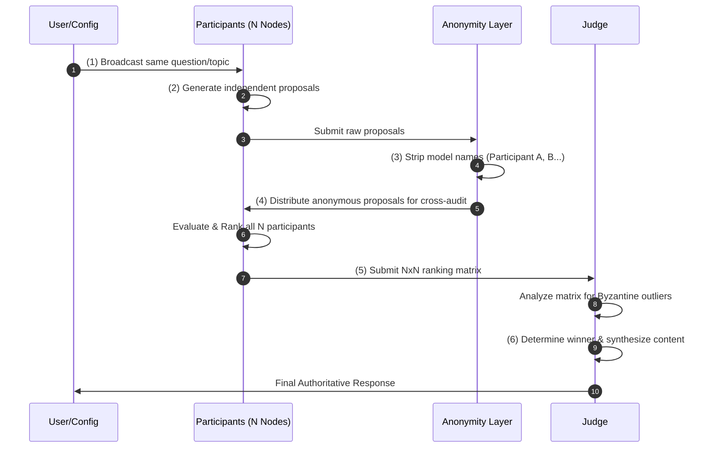
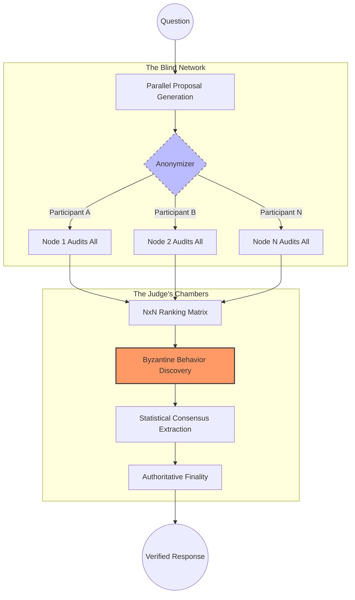

# ByzantineLLM - Architecture Documentation

## Overview

ByzantineLLM is a decentralized research framework for studying **Byzantine Fault Tolerance (BFT)** and emergent truth in Large Language Model clusters. It implements a strict N x N ranking protocol where participants are fully anonymous and the system has zero prior knowledge of adversarial agents.

---

## 🏗️ The 6-Step Consensus Workflow

The system follows a deterministic communication flow between independent nodes and a central Judge.

---

## 🛡️ The Zero-Trust Analysis Loop

The framework is designed to move from decentralized generation to centralized verification through rigorous cross-auditing and statistical discovery of "Byzantine" behavior.

---

## Core Components

### 1. The Nodes (N Participants)
Nodes are entirely independent and receive no special instructions or labeling.
- **Proposal Generation:** Every node answers the same prompt independently.
- **Blind Cross-Auditing:** Nodes evaluate anonymous versions of all $N$ proposals (including their own).
- **Independent Ranking:** Nodes produce a ranked list (Best to Worst) based on Accuracy, Completeness, and Logic.

### 2. The Anonymity Layer
A middleware that ensures evaluations are purely content-based.
- **Labeling:** Replaces node names/models with IDs like "Participant A", "Participant B".
- **Blind Matrix:** Ensures the $N \times N$ matrix submitted to the Judge is free of identity-based bias.

### 3. The Judge (Judge Model)
The final authority that analyzes the network's self-evaluation.
- **Outlier Detection:** Identifies "Byzantine" behavior by looking for nodes whose rankings deviate significantly from the majority or provide inconsistent feedback.
- **Aggregate Consensus:** Calculates the most reliable ranking based on the cross-auditing results.
- **Authoritative Synthesis:** Generates a final report synthesized from the content of the top-ranked "verified" nodes.

---

## Execution Logic

1.  **Request:** User provides a topic.
2.  **Proposal:** $N$ nodes generate responses.
3.  **Prepare:** Anonymized proposals are sent back to all $N$ nodes.
4.  **Audit:** Nodes submit their anonymous rankings to the Judge.
5.  **Commit:** Judge analyzes the $N \times N$ table for Byzantine behavior.
6.  **Finality:** Judge publishes the final authoritative consensus report.
